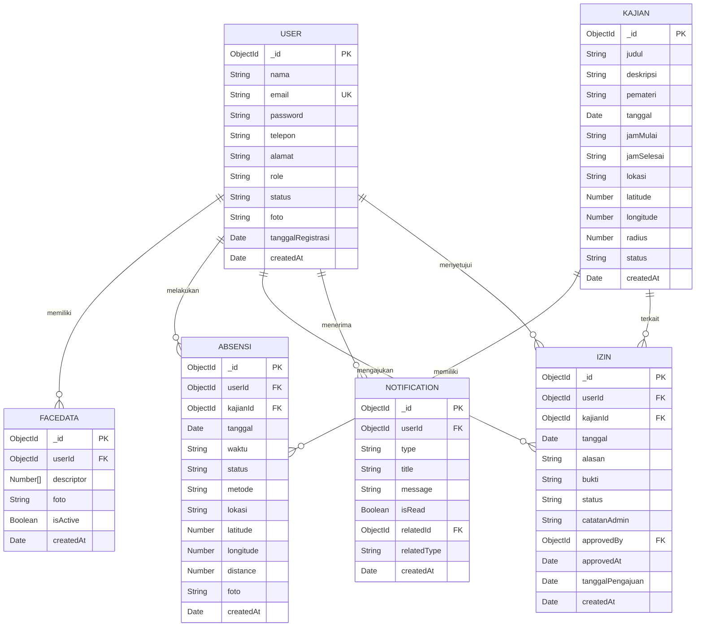

# ERD Final - Sistem Absensi Kajian Masjid Al-Hikmah

## 1. Daftar Entity Final

1. **User** - Menyimpan data pengguna (admin dan jamaah)
2. **FaceData** - Menyimpan data biometrik wajah untuk face recognition
3. **Kajian** - Menyimpan data kajian/schedule
4. **Absensi** - Menyimpan data kehadiran jamaah
5. **Izin** - Menyimpan data pengajuan izin
6. **Notification** - Menyimpan data notifikasi untuk real-time updates

---

## 2. Struktur Field Setiap Entity

### 2.1 User

| Field | Tipe Data | Required/Optional | Keterangan |
|-------|-----------|-------------------|------------|
| _id | ObjectId | Required | Primary key (auto-generated) |
| nama | String | Required | Nama lengkap pengguna |
| email | String | Required | Email pengguna (unique) |
| password | String | Required | Password (hashed dengan bcrypt) |
| telepon | String | Required | Nomor telepon |
| alamat | String | Required | Alamat lengkap |
| role | String | Required | Enum: ['admin', 'jamaah'] |
| status | String | Required | Enum: ['aktif', 'nonaktif'], default: 'aktif' |
| foto | String | Optional | Path/URL foto profil |
| tanggalRegistrasi | Date | Required | Tanggal registrasi, default: Date.now() |
| createdAt | Date | Required | Timestamp pembuatan (auto-generated) |

---

### 2.2 FaceData

| Field | Tipe Data | Required/Optional | Keterangan |
|-------|-----------|-------------------|------------|
| _id | ObjectId | Required | Primary key (auto-generated) |
| userId | ObjectId | Required | Reference ke User |
| descriptor | [Number] | Required | Array 128-dimensional face descriptor dari face-api.js |
| foto | String | Required | Path/URL foto wajah saat registrasi |
| isActive | Boolean | Required | Status aktif, default: true |
| createdAt | Date | Required | Timestamp pembuatan (auto-generated) |

---

### 2.3 Kajian

| Field | Tipe Data | Required/Optional | Keterangan |
|-------|-----------|-------------------|------------|
| _id | ObjectId | Required | Primary key (auto-generated) |
| judul | String | Required | Judul kajian |
| deskripsi | String | Optional | Deskripsi kajian |
| pemateri | String | Required | Nama pemateri |
| tanggal | Date | Required | Tanggal kajian |
| jamMulai | String | Required | Jam mulai (format HH:mm) |
| jamSelesai | String | Required | Jam selesai (format HH:mm) |
| lokasi | String | Required | Nama lokasi (misal: "Masjid Al-Hikmah") |
| latitude | Number | Required | Koordinat lokasi untuk validasi GPS |
| longitude | Number | Required | Koordinat lokasi untuk validasi GPS |
| radius | Number | Required | Batas jarak dalam meter, default: 50 (configurable) |
| status | String | Required | Enum: ['aktif', 'nonaktif'], default: 'aktif' |
| createdAt | Date | Required | Timestamp pembuatan (auto-generated) |

---

### 2.4 Absensi

| Field | Tipe Data | Required/Optional | Keterangan |
|-------|-----------|-------------------|------------|
| _id | ObjectId |_required | Primary key (auto-generated) |
| userId | ObjectId | Required | Reference ke User |
| kajianId | ObjectId | Required | Reference ke Kajian |
| tanggal | Date | Required | Tanggal absensi (mengikuti tanggal kajian) |
| waktu | String | Required | Waktu absensi (format HH:mm) |
| status | String | Required | Enum: ['hadir', 'izin', 'tidak_hadir'], default: 'hadir' |
| metode | String | Required | Enum: ['face_recognition'], default: 'face_recognition' |
| lokasi | String | Required | Deskripsi lokasi saat absensi |
| latitude | Number | Required | Koordinat GPS saat absensi |
| longitude | Number | Required | Koordinat GPS saat absensi |
| distance | Number | Required | Jarak dari lokasi kajian dalam meter |
| foto | String | Required | Path/URL foto saat absensi untuk verifikasi |
| createdAt | Date | Required | Timestamp pembuatan (auto-generated) |

---

### 2.5 Izin

| Field | Tipe Data | Required/Optional | Keterangan |
|-------|-----------|-------------------|------------|
| _id | ObjectId | Required | Primary key (auto-generated) |
| userId | ObjectId | Required | Reference ke User (jamaah) |
| kajianId | ObjectId | Required | Reference ke Kajian |
| tanggal | Date | Required | Tanggal izin |
| alasan | String | Required | Alasan izin |
| bukti | String | Optional | Path/URL file bukti pendukung |
| status | String | Required | Enum: ['pending', 'disetujui', 'ditolak'], default: 'pending' |
| catatanAdmin | String | Optional | Catatan saat approve/reject |
| approvedBy | ObjectId | Optional | Reference ke User (admin yang approve/reject) |
| approvedAt | Date | Optional | Waktu approve/reject |
| tanggalPengajuan | Date | Required | Tanggal pengajuan, default: Date.now() |
| createdAt | Date | Required | Timestamp pembuatan (auto-generated) |

---

### 2.6 Notification

| Field | Tipe Data | Required/Optional | Keterangan |
|-------|-----------|-------------------|------------|
| _id | ObjectId | Required | Primary key (auto-generated) |
| userId | ObjectId | Required | Reference ke User (penerima notifikasi) |
| type | String | Required | Enum: ['absensi', 'izin', 'jamaah_baru', 'statistik'] |
| title | String | Required | Judul notifikasi |
| message | String | Required | Pesan notifikasi |
| isRead | Boolean | Required | Status dibaca, default: false |
| relatedId | ObjectId | Optional | Reference ke entity terkait (misal: absensiId, izinId) |
| relatedType | String | Optional | Enum: ['absensi', 'izin', 'user'] |
| createdAt | Date | Required | Timestamp pembuatan (auto-generated) |

---

## 3. Relationship dan Cardinality

```
User 1 ---- N FaceData
User 1 ---- N Absensi
Kajian 1 ---- N Absensi
User 1 ---- N Izin
Kajian 1 ---- N Izin
User 1 ---- N Notification
User 1 ---- N Izin (sebagai approvedBy/admin)
```

---

## 4. Primary Key / ObjectId

Semua entity menggunakan **_id** sebagai primary key dengan tipe data **ObjectId** (auto-generated oleh MongoDB).

---

## 5. Foreign Key / Reference

| Entity | Field | Reference ke |
|--------|-------|--------------|
| FaceData | userId ➜ | User._id |
| Absensi | userId ➜ | User._id |
| Absensi | kajianId ➜ | Kajian._id |
| Izin | userId ➜ | User._id |
| Izin | kajianId ➜ | Kajian._id |
| Izin | approvedBy ➜ | User._id |
| Notification | userId ➜ | User._id |
| Notification | relatedId ➜ | Entity terkait (opsional) |

---

## 6. Index dan Unique Constraint

### 6.1 User
```javascript
db.user.createIndex({ email: 1 }, { unique: true })
db.user.createIndex({ role: 1 })
db.user.createIndex({ status: 1 })
```

### 6.2 FaceData
```javascript
db.facedata.createIndex({ userId: 1 })
db.facedata.createIndex({ userId: 1, isActive: 1 })
```

### 6.3 Kajian
```javascript
db.kajian.createIndex({ tanggal: 1 })
db.kajian.createIndex({ status: 1 })
```

### 6.4 Absensi
```javascript
db.absensi.createIndex({ userId: 1 })
db.absensi.createIndex({ kajianId: 1 })
db.absensi.createIndex({ tanggal: 1 })
db.absensi.createIndex({ userId: 1, kajianId: 1 }, { unique: true }) // Mencegah duplikasi absensi
```

### 6.5 Izin
```javascript
db.izin.createIndex({ userId: 1 })
db.izin.createIndex({ kajianId: 1 })
db.izin.createIndex({ status: 1 })
db.izin.createIndex({ tanggal: 1 })
```

### 6.6 Notification
```javascript
db.notification.createIndex({ userId: 1 })
db.notification.createIndex({ isRead: 1 })
db.notification.createIndex({ userId: 1, isRead: 1 })
db.notification.createIndex({ createdAt: -1 })
```

---

## 7. Validasi Penting

### 7.1 User
- email: required, unique, valid email format
- password: required, min 6 characters (sebelum hash)
- nama: required
- telepon: required
- alamat: required
- role: enum ['admin', 'jamaah']
- status: enum ['aktif', 'nonaktif']

### 7.2 FaceData
- userId: required, reference ke User
- descriptor: required, array of numbers
- foto: required
- isActive: boolean, default true

### 7.3 Kajian
- judul: required
- pemateri: required
- tanggal: required
- jamMulai: required
- jamSelesai: required
- lokasi: required
- latitude: required, number
- longitude: required, number
- radius: required, number, default 50
- status: enum ['aktif', 'nonaktif']
- jamSelesai > jamMulai (custom validation)

### 7.4 Absensi
- userId: required, reference ke User
- kajianId: required, reference ke Kajian
- tanggal: required
- waktu: required
- status: enum ['hadir', 'izin', 'tidak_hadir']
- metode: enum ['face_recognition']
- lokasi: required
- latitude: required
- longitude: required
- distance: required
- foto: required
- Unique: userId + kajianId

### 7.5 Izin
- userId: required, reference ke User
- kajianId: required, reference ke Kajian
- tanggal: required
- alasan: required
- status: enum ['pending', 'disetujui', 'ditolak']
- approvedBy: optional, reference ke User (must be admin)
- approvedAt: optional

### 7.6 Notification
- userId: required, reference ke User
- type: enum ['absensi', 'izin', 'jamaah_baru', 'statistik']
- title: required
- message: required
- isRead: boolean, default false

---

## 8. Diagram ERD (Mermaid)



---

## 9. Penjelasan Singkat Setiap Relationship

### 9.1 User 1 ---- N FaceData
- Satu user dapat memiliki banyak FaceData untuk mendukung registrasi ulang
- Hanya FaceData dengan isActive: true yang digunakan untuk matching
- Saat registrasi ulang, FaceData lama di-set isActive: false

### 9.2 User 1 ---- N Absensi
- Satu user dapat melakukan absensi untuk banyak kajian
- Setiap absensi tercatat dengan userId dan kajianId
- Unique constraint (userId + kajianId) mencegah duplikasi

### 9.3 Kajian 1 ---- N Absensi
- Satu kajian dapat dihadiri oleh banyak jamaah
- Digunakan untuk menghitung statistik kehadiran per kajian

### 9.4 User 1 ---- N Izin
- Satu user dapat mengajukan banyak izin
- Setiap izin tercatat dengan userId dan kajianId

### 9.5 Kajian 1 ---- N Izin
- Satu kajian dapat memiliki banyak pengajuan izin
- Digunakan untuk melihat izin per kajian

### 9.6 User 1 ---- N Notification
- Satu user dapat menerima banyak notifikasi
- Digunakan untuk real-time updates dengan Socket.IO

### 9.7 User 1 ---- N Izin (sebagai approvedBy)
- Satu admin dapat approve/reject banyak izin
- approvedBy mencatat admin yang melakukan approval

---

## 10. Daftar Perubahan dari ERD Sebelumnya

### 10.1 Perubahan Field
- **Hapus updatedAt** dari semua entity - Mongoose timestamps akan menangani ini secara otomatis
- **Sederhanakan unique constraint Absensi** dari (userId + kajianId + tanggal) menjadi (userId + kajianId) karena tanggal absensi selalu mengikuti tanggal kajian
- **Tambahkan catatan "configurable"** pada radius Kajian - default 50 meter tapi dapat diubah
- **Tambahkan catatan** bahwa tanggal Absensi mengikuti tanggal Kajian

### 10.2 Perubahan Dokumentasi
- **Hapus referensi ke entity tambahan** seperti RefreshToken, AuditLog, Location - dijelaskan sebagai mekanisme/teknologi, bukan entity database
- **Perjelas bahwa Role dan Status adalah enum** di User, bukan entity terpisah
- **Perjelas bahwa Socket.IO adalah mekanisme komunikasi**, bukan entity database

### 10.3 Perubahan Struktur
- **Format tabel** untuk field setiap entity lebih jelas dengan kolom Tipe Data dan Required/Optional
- **Penambahan diagram Mermaid** yang lengkap dengan field
- **Penambahan penjelasan relationship** yang lebih detail

---

## 11. Daftar Keputusan yang Masih Perlu Dikonfirmasi dengan Stakeholder

1. **Radius default untuk validasi lokasi** - Saat ini default 50 meter (configurable). Apakah nilai ini sesuai dengan kebutuhan nyata?
2. **Maksimal file size untuk bukti izin** - Prototype menyebut "Maks 5MB". Apakah ini final?
3. **Format file yang diterima untuk bukti izin** - Prototype: JPG, PNG, PDF. Apakah ada format lain yang perlu didukung?
4. **Apakah notifikasi perlu dihapus otomatis setelah periode tertentu?** - Untuk mengontrol ukuran collection (misal: 30 hari)
5. **Apakah ada batas maksimal FaceData per user?** - Untuk mencegah abuse (misal: maks 5 FaceData aktif per user)
6. **Apakah perlu audit log untuk admin actions?** - Delete jamaah, approve/reject izin, dll (opsional untuk fase selanjutnya)

---

## 12. Rekomendasi

### Status: **SIAP untuk tahap berikutnya**

ERD ini sudah cukup final dan siap untuk diterjemahkan menjadi Mongoose Schema dan API Design karena:

✅ **Semua fitur requirement memiliki entity/field yang mendukungnya:**
- Login/logout → User dengan email, password, role
- CRUD jamaah → User dengan role='jamaah'
- Registrasi wajah → FaceData dengan descriptor dan foto
- Absensi face recognition → Absensi dengan metode='face_recognition'
- Validasi GPS → Kajian (latitude, longitude, radius) dan Absensi (latitude, longitude, distance)
- Pengajuan izin → Izin dengan bukti optional
- Approve/reject izin → Izin dengan approvedBy, approvedAt, status
- Notifikasi realtime → Notification dengan userId, type, relatedId

✅ **Semua entity digunakan oleh prototype:**
- User → dummyJamaah, dummyAdmin, Register.jsx, Login.jsx
- FaceData → JamaahRegistrasiWajah.jsx
- Kajian → dummyKajian, AdminKajian.jsx
- Absensi → dummyAbsensi, AdminAbsensi.jsx, JamaahAbsensi.jsx
- Izin → dummyIzin, AdminIzin.jsx, JamaahIzin.jsx
- Notification → dummyNotifikasi, AdminNotifikasi.jsx

✅ **Tidak ada field yang asumsi tanpa dasar:**
- Semua field berdasarkan prototype atau requirement
- Field tambahan (latitude, longitude, distance, bukti, approvedBy, approvedAt) diperlukan untuk fitur yang ada di prototype

✅ **Hubungan antar entity sudah benar:**
- Semua relationship adalah 1:N
- Cardinality sesuai dengan kebutuhan sistem
- Foreign key menggunakan ObjectId

✅ **User dan FaceData dipisahkan dengan benar:**
- User menyimpan data profil
- FaceData menyimpan data biometrik
- Mendukung registrasi ulang dengan isActive flag

✅ **Jadwal Kajian sudah terstruktur:**
- Tidak menggunakan string "jadwal"
- Terpisah menjadi tanggal, jamMulai, jamSelesai

✅ **Lokasi Kajian mendukung GPS:**
- latitude, longitude, radius untuk validasi lokasi
- lokasi sebagai nama/deskripsi

✅ **Absensi menyimpan lokasi aktual peserta:**
- latitude, longitude, distance dari lokasi kajian
- foto untuk verifikasi

✅ **Izin mendukung approve/reject oleh Admin:**
- approvedBy, approvedAt, catatanAdmin untuk audit trail

✅ **Notification mendukung notifikasi realtime:**
- userId, type, relatedId, relatedType untuk Socket.IO
- isRead untuk tracking status baca

✅ **ERD tidak terlalu kompleks untuk skripsi:**
- Hanya 6 entity utama
- Semua relationship adalah 1:N
- Tidak ada junction table
- Mudah diimplementasikan dengan Mongoose

✅ **ERD dapat langsung diterjemahkan menjadi Mongoose Schema:**
- Semua field sudah memiliki tipe data yang jelas
- Semua enum sudah didefinisikan
- Semua reference sudah ditentukan
- Index dan constraint sudah dirancang

### Langkah Selanjutnya:
1. **ERD → Mongoose Schema** - Terjemahkan entity menjadi Mongoose models dengan validasi
2. **API Design** - Rancang REST API endpoints berdasarkan schema
3. **Implementasi Backend** - Mulai coding dengan Node.js + Express.js + MongoDB

ERD ini sudah final dan siap untuk tahap implementasi backend.
